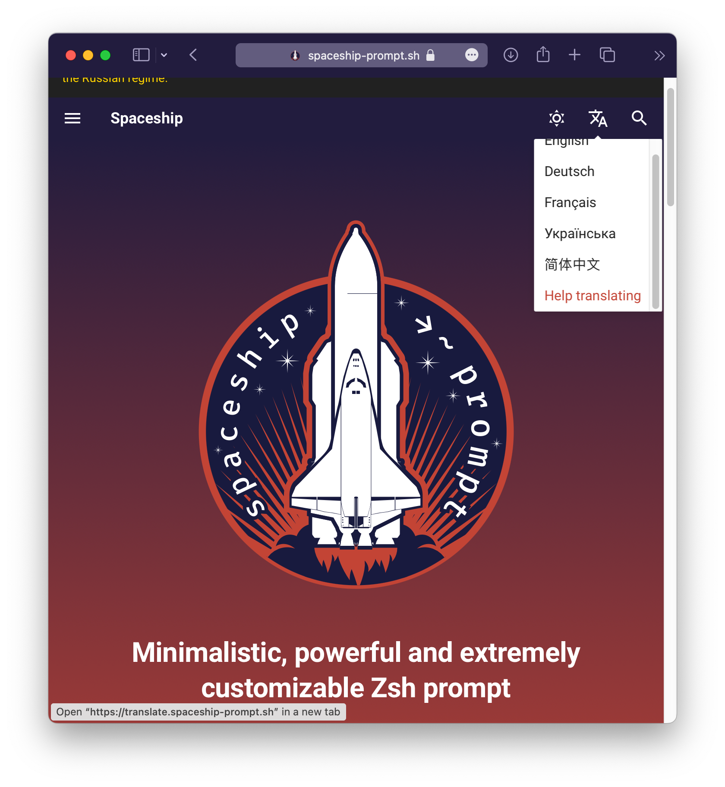

# Setting up mkdocs-material

The `mkdocs-static-i18n` plugin aims at providing best-in-class support to the [mkdocs-material](https://squidfunk.github.io/mkdocs-material/) theme and plugins users!

As such, it will do its best to automagically adjust the `mkdocs-material` theme configuration per language such as its `lang` and `extra.alternates` language switcher.

!!! tip
    The `mkdocs-material` language switcher will also benefit from the [alternate awareness of the plugin](using-alternates.md) as it will contextualize the links of the language switcher to point to the language alternates of the current page instead of just pointing to the root the each configured language.

    This will smoothen your users' experience as they will be able to switch from one language to another on the same page!

This feature is controlled by the `reconfigure_material` option and you can [personalize your language builds even further using the languages options](setting-up-languages.md).

## Option: `reconfigure_material`

|required|default|allowed values|
|---|---|---|
|no|true| true \| false|

``` yaml
plugins:
  - i18n:
    reconfigure_material: true
```

## Adding a special item in the language switcher

If you want to add a special item in the automatically generated language switcher pointing to a fixed link, use the special `null` locale.

``` yaml
plugins:
  - i18n:
    languages:
        - locale: en
          name: English
          build: true
          default: true
        - locale: fr
          name: Français
          build: true
        - locale: null
          name: Help translating
          build: false
          fixed_link: https://spaceship-prompt.sh/contribute/?h=trans#Translating
```

{width=450}

## Features

!!! failure "Incompatibility"
    The `navigation.instant` feature is **NOT compatible** with the multi-language switcher. The plugin will issue a WARNING log if you try using it.

- [x] Automatic language setup
- [x] Automatic language switcher setup
- [x] Automatic language switcher contextual link setup
- [x] Search plugin localization and result deduplication
- [ ] Blog plugin localization
