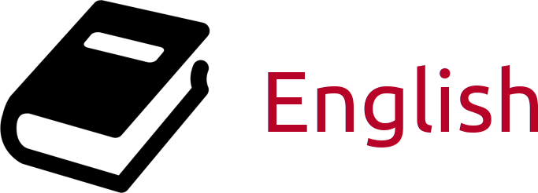

# Home page (default version + english version)

!!! tip
    **Use the language switcher in the header** to switch between the localized versions of this demo website. This switcher is part of [mkdocs-material >= 7.1.0](https://squidfunk.github.io/mkdocs-material/setup/changing-the-language/#site-language-selector) and is **automatically configured by this plugin** or can be statically configured from the [mkdocs.yml file](https://github.com/ultrabug/mkdocs-static-i18n/blob/main/mkdocs.yml).

## What you are seeing now

This page source file and media content have been localized after applying
the [localized build logic](#localized-build-logic) described below. Here is a
quick recap of the files used as source and the generated build structure of
what you see:

```
docs
├── image.en.png  <-- this image file is used here
├── image.fr.png
├── index.fr.md
├── index.md  <-- this file is used here
├── topic1
│   ├── named_file.en.md
│   └── named_file.fr.md
└── topic2
    ├── index.en.md
    └── index.md
```

```
site
├── en
│   ├── image.png  <-- you see this image here on the /en version
│   ├── index.html  <-- you are here on the /en version
│   ├── topic1
│   │   └── named_file
│   │       └── index.html
│   └── topic2
│       └── index.html
├── fr
│   ├── image.png
│   ├── index.html
│   ├── topic1
│   │   └── named_file
│   │       └── index.html
│   └── topic2
│       └── index.html
├── image.png  <-- you see this image here on the default version
├── index.html  <-- you are here on the default version
├── topic1
│   └── named_file
│       └── index.html
└── topic2
    └── index.html
```

## Automatic media / link / asset localization



This image source is dynamically localized while still being referenced in the
markdown source of the page as ``. This means that
this plugin allows you to not worry about links, media and static content file
names, just use their simple name and concentrate on your content translation!

Of course, images can also not be localized just like the image below which is
used by all versions of your pages:


---

## Localized build logic

The settings used to build this site is:

```
plugins:
  - i18n:
      default_language: en
      languages:
        en: english
        fr: français
```

Meaning that we will get three versions of our website:

1. the `default_language` version which will use any `.md` documentation file first and fallback to any `.en.md` file found since `en` is the default language
2. the `/en` language version which will use any `.en.md` documentation file first and fallback to any `.md` file found
3. the `/fr` language version which will use any `.fr.md` documentation file first and fallback to either `.en.md` file (default language) or `.md` file (default language fallback) whichever comes first

Given that logic, the following `site` structure is built:

```
site
├── 404.html
├── assets
│   ├── images
│   ├── javascripts
│   └── stylesheets
├── en
│   ├── image.png
│   ├── index.html
│   ├── topic1
│   │   └── named_file
│   │       └── index.html
│   └── topic2
│       └── index.html
├── fr
│   ├── image.png
│   ├── index.html
│   ├── topic1
│   │   └── named_file
│   │       └── index.html
│   └── topic2
│       └── index.html
├── image.png
├── index.html
├── topic1
│   └── named_file
│       └── index.html
└── topic2
    └── index.html
```
